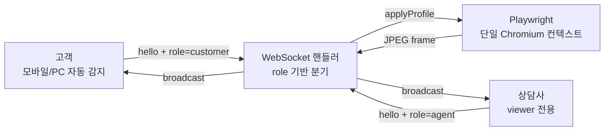

# Co-browsing PoC — eformsign 화면 미러링

> Playwright CDP screencast 기반 코브라우징 기술 타당성 검증용 PoC

코브라우징 SaaS 개발에 앞서 핵심 파이프라인의 동작 가능성을 검증하기 위해 작성된 샘플 프로젝트입니다. 금융권 SI 컨텍스트에서 자주 사용되는 eformsign(OZ HTML5) 모바일 빌드의 화면 공유 시나리오를 대상으로 합니다.

## 검증된 기술 사항

- Playwright CDP `Page.startScreencast` 기반 100ms 틱 JPEG 미러링
- OZ HTML5 모바일 빌드의 가독성 문제 해결 (DPR 강제 고정)
- **일반 웹페이지에서 원본 대비 시각적으로 거의 손실 없는 화질 확인** (Daum 뉴스 페이지 PC 프로파일, JPEG quality=80, 비트맵 2560×1600)
- 클라이언트 디바이스 자동 감지 및 PC/모바일 프로파일 전환
- 상담사/고객 역할 분리 + 단일 컨텍스트 공유 모델
- 클라이언트 재연결 시 입력 데이터 보존
- iPhone Safari, Android Chrome 실 디바이스 검증 완료

## 아키텍처



### 역할 분리 원칙

- **고객(`/`)** — 디바이스 정보를 서버에 전달, 컨텍스트(viewport/UA) 결정권 보유
- **상담사(`/agent`)** — 동일 컨텍스트를 viewer로 시청, 컨텍스트 변경 권한 없음
- **단일 컨텍스트** — 양쪽이 같은 Chromium 페이지를 공유하므로 입력 데이터 일관성 보장

### 상태 전이 규칙

| 이벤트 | 동작 |
|---|---|
| 초기 부팅 | `customerJoined=false`, 대기용 PC 컨텍스트 |
| 상담사 먼저 합류 | viewer로 추가, 컨텍스트 변경 없음 |
| 첫 고객 합류 | `customerJoined=true`, 고객 device 기준으로 컨텍스트 결정 |
| 고객 재연결 (같은 device) | 컨텍스트 보존, 입력 데이터 유지 |
| 고객 재연결 (다른 device) | 경고 메시지, 기존 컨텍스트 유지 |
| 추가 상담사 합류 | viewer 추가, 컨텍스트 영향 없음 |

## 빠른 시작

### 사전 요구사항

- Node.js 18 이상
- npm 또는 yarn
- 같은 Wi-Fi 네트워크 (실 디바이스 테스트 시)

### 설치

```bash
npm install
npx playwright install chromium
```

### 환경변수 설정

```bash
cp .env.example .env
# .env 파일을 열어 INITIAL_URL을 실제 eformsign URL로 변경
```

### 실행

```bash
npm start
```

콘솔에 다음과 같이 출력됩니다.

```
Co-browsing server running:
  Customer: http://localhost:3000/
  Agent:    http://localhost:3000/agent
```

### 실 디바이스 접속

1. PC IP 확인
   ```powershell
   ipconfig | findstr /C:"IPv4"
   ```
2. Windows 방화벽 3000 포트 허용
   ```powershell
   New-NetFirewallRule -DisplayName "CoBrowsing 3000" -Direction Inbound -LocalPort 3000 -Protocol TCP -Action Allow
   ```
3. 모바일에서 `http://[PC-IP]:3000` 접속

## 핵심 설계 결정

### 1. DPR 강제 고정으로 OZ HTML5 가독성 해결

eformsign 모바일 빌드의 약관 본문이 헤드리스 환경에서 흐릿하게 렌더링되는 문제를 발견했습니다. 원인은 Windows 디스플레이 배율(OS DPR)이 헤드리스 환경에서 1로 떨어지면서 OZ가 저해상도 Canvas로 그렸기 때문입니다.

**해결책** — Chromium launch args에 다음을 추가하여 OS 배율과 무관하게 일관된 고화질을 보장합니다.

```javascript
args: [
  '--force-device-scale-factor=2',
  '--high-dpi-support=1',
]
```

**부수 효과로 확인된 사항** — 이 설정은 OZ HTML5뿐 아니라 일반 웹페이지 전반에 적용되며, Daum 뉴스 페이지 PC 프로파일 검증 결과 원본 대비 시각적으로 거의 손실 없는 미러링 화질을 보였습니다. 따라서 이 파이프라인은 eformsign 외 일반 웹 콘텐츠를 다루는 코브라우징 시나리오에도 그대로 적용 가능합니다.

### 2. 고객 디바이스 기준 단일 컨텍스트

코브라우징의 본질은 "고객이 보는 화면을 상담사가 그대로 본다"입니다. 양쪽이 각자의 디바이스 viewport로 보는 것은 OZ HTML5와 같은 페이지 메모리 기반 상태를 동기화할 방법이 사실상 없어 비현실적입니다.

따라서 **고객 device가 컨텍스트를 결정**하고, 상담사는 고객 화면을 그대로 시청하는 구조를 채택했습니다.

### 3. 컨텍스트 보존을 위한 `customerJoined` 플래그

초기 구현에서는 마지막 hello 메시지를 보낸 클라이언트의 device로 컨텍스트가 결정되었습니다. 이로 인해 상담사 합류 시 컨텍스트가 재시작되면서 고객 입력 데이터가 손실되는 결함이 발생했습니다.

**해결책** — 첫 고객 합류 시점에만 컨텍스트를 결정하고, 이후 재연결이나 추가 합류는 컨텍스트에 영향을 주지 않도록 분리했습니다.

```javascript
if (role === 'customer') {
  if (!session.customerJoined) {
    session.customerJoined = true;
    session.customerDevice = device;
    if (device !== session.profileName) {
      await applyProfile(device);
    }
  } else if (device !== session.customerDevice) {
    // 경고만, 컨텍스트는 보존
  }
}
```

## 검증 결과

| 항목 | iPhone 12 Pro Max | iPhone Pro | Android Chrome |
|---|:-:|:-:|:-:|
| 모바일 프로파일 자동 전환 | ✅ | ✅ | ✅ |
| eformsign 본문 가독성 | ✅ | ✅ | ✅ |
| 약관 동의 → 회원가입 폼 진입 | ✅ | ✅ | ✅ |
| 클릭 이벤트 처리 | ✅ | ✅ | ✅ |

| 시나리오 | 결과 |
|---|:-:|
| 상담사 먼저 → 고객 합류 시 컨텍스트 정상 결정 | ✅ |
| 고객 먼저 → 상담사 합류 시 컨텍스트 보존 | ✅ |
| 양방향 동시 인터랙션 | ✅ |
| 와이파이 끊김 후 재연결 시 입력 데이터 보존 | ✅ |
| 일반 웹페이지 미러링 화질 (Daum 뉴스, PC 프로파일) | ✅ 원본 거의 동등 |

### 화질 검증 범위 및 한계

위 화질 결과는 다음 조건에서의 검증입니다.

- PC 프로파일 (1280×800, DSR=2, 비트맵 2560×1600)
- 정적 콘텐츠 (텍스트 + 이미지 위주)
- 같은 PC 내 localhost 비교

다음은 본 PoC 스코프 외로, 운영 적용 시 별도 검증이 필요합니다.

- 모바일 프로파일(430×932, DSR=3)에서의 일반 웹페이지 화질
- 동영상, WebGL, Canvas 게임 등 동적 콘텐츠의 화질/레이턴시
- 원거리 네트워크 환경에서의 체감 레이턴시

## 미해결 항목 (본 프로젝트로 이관)

본 PoC의 스코프 외 영역으로, 실제 운영 코브라우징 SaaS에서 별도 이터레이션이 필요합니다.

- **한글 IME 처리** — `compositionstart/update/end` 이벤트 → `page.keyboard.insertText()` 라우팅
- **터치 좌표 정확도** — `touchstart/move/end` → CDP `Input.dispatchTouchEvent`
- **모바일 스크롤** — wheel 이벤트가 아닌 터치 스와이프 처리
- **viewport meta 정책** — 코브라우징 UI 자체의 핀치줌 정책 결정
- **다중 세션 격리** — 현재는 단일 세션, 운영 시 세션별 컨텍스트 풀링 필요
- **상담사 인증** — 현재 `/agent` URL은 누구나 접근 가능, 운영 시 토큰 인증 필요
- **헤드리스 운영** — 현재 `headless: false`, 컨테이너 운영 시 `xvfb` 또는 `--use-angle=swiftshader` 검토

## 기술 스택

- Node.js + Express + ws
- Playwright (Chromium) + CDP screencast
- 클라이언트: Vanilla JS + Canvas API + WebSocket

## 디렉토리 구조

```
.
├── server.js              # WebSocket 서버 + Playwright 컨트롤러
├── public/
│   ├── index.html         # 고객용 페이지 (role=customer)
│   └── agent.html         # 상담사용 페이지 (role=agent)
├── package.json
├── .env.example           # 환경변수 템플릿
├── .gitignore
└── README.md
```

## 라이선스

```
Copyright (c) 2026 Mada51. All Rights Reserved.

본 소프트웨어 및 관련 문서 일체(이하 "본 저작물")는 저작권자의 독점적
지적 재산입니다.

저작권자의 명시적 사전 서면 동의 없이는 다음 행위를 일절 금지합니다.

  - 본 저작물의 전부 또는 일부의 복제, 배포, 전송, 공중송신
  - 본 저작물의 수정, 편집, 2차적 저작물 작성
  - 본 저작물의 상업적 또는 비상업적 이용
  - 본 저작물에 포함된 코드, 설계, 기술적 노하우의 추출 및 재사용
  - 학습 데이터셋, AI 모델 학습 자료로의 활용

본 저작물은 "있는 그대로(AS IS)" 제공되며, 명시적이든 묵시적이든
어떠한 보증도 제공되지 않습니다. 저작권자는 본 저작물의 사용으로
인해 발생하는 어떠한 손해에 대해서도 책임지지 않습니다.

라이선스 문의: GitHub @Mada51
```